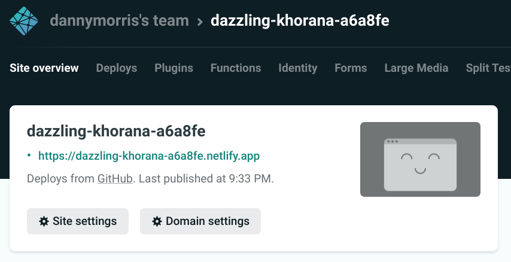
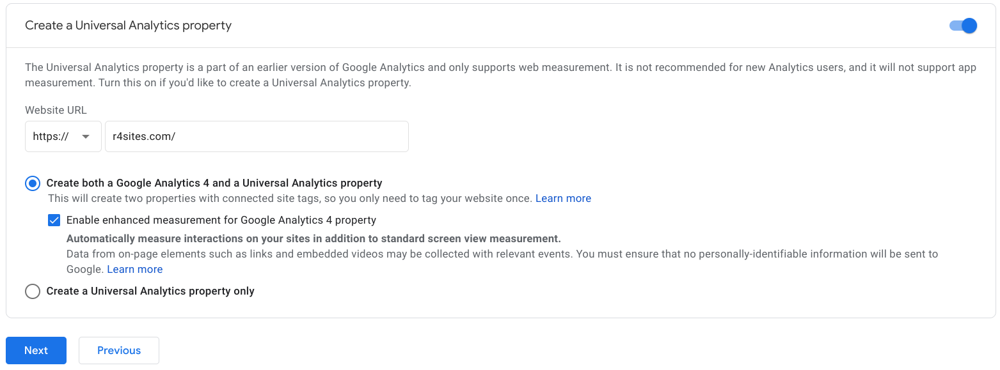
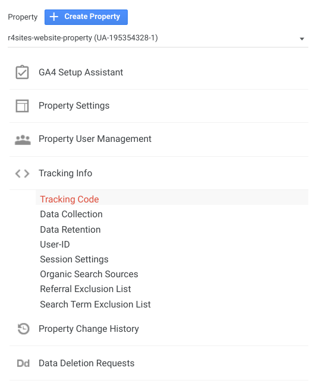
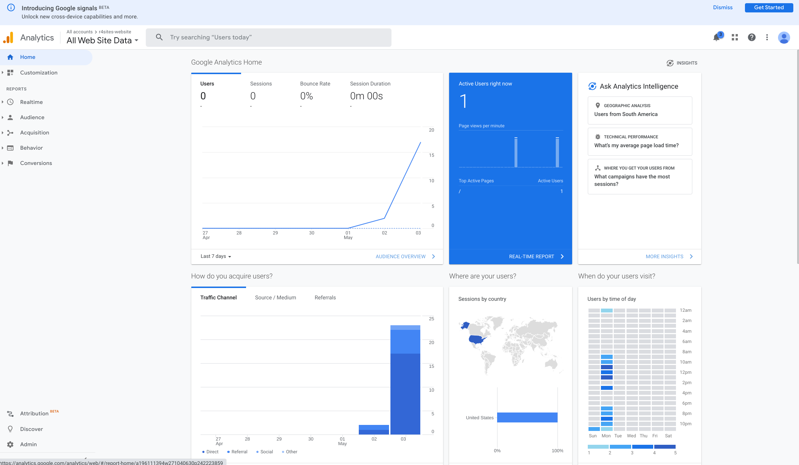

# Introduction

## About this book

In 2018, I had virtually no online presence other than about 100 random LinkedIn connections. I knew this was a problem given my budding interest in Data Science, the increasing demand for project portfolios, and my perceived need to "stand out" in the digital crowd.

So, I learned how to publish my first personal website, [Abnormal Distributions](https://abndistro.com/). Yes, I know, it looks outdated and definitely not as cool as [this website](https://benc.dev/). However, Abnormal Distributions took my online presence and my career to new heights. Since going live, Abnormal Distributions has served over 50,000 page views and 20,000 users from all over the world. 

I began posting content on LinkedIn with links to my website, and in the span of a year I received 1,700 LinkedIn connection requests from Data Scientists and professionals in related fields. I began receiving job opportunities from recruiters who discovered me by landing on my website. Abnormal Distributions sparked my creativity, deepened my subject matter expertise through writing, and gave me the tools I needed to confidently engage with the digital crowd. It turned out to be a wonderful investment of time and energy.

**My goal with this book is to help you launch your own personal website** and, hopefully, experience the same personal transformation that I experienced after I launched mine. 

You will learn the exact methodology that I use to create, design, publish, and analyze websites using R, RStudio, and other freely available tools including GitHub, Hugo, Netlify, and Google Analytics. No prior experience in web development, R, or any of the aforementioned tools is needed to be successful with this book.

## Target audience

The target audience for this book includes students, working professionals, and researchers who want to launch their very own personal website. Most likely, however, this book will appeal to individuals in these segments who associate with R, Data Analytics, Data Science, Machine Learning, Statistics, Mathematics, and related fields where technical writing is common.

Note that you do not have to be an experienced web developer to successfully use the methodology described in this book. To learn more about whether or not this book is right for you, check out the [FAQ](#faq) section. 

## Reasons to have a website

There are many excellent reasons to have a personal website. Below is a list of ideas to motivate your thinking.

- **Captivate an audience**. A personal website presents an amazing opportunity to captivate audiences including professional recruiters, hiring managers, current employers, colleagues, fellow students, and more. Having your own website featuring your original content is one of the best ways to gain recognition and increase your competitive advantage. 

- **Enrich your social media presence.** Personal websites give your social media viewers a path to learning more about you and the work you are doing. Start by enriching your LinkedIn profile by inserting links to your website in your headline, summary, Featured section, and any posts you make.

- **Personalize your job applications.** If there is a job you really want or a company you would love to work for, create a personalized website for this company with hyperfocused content and share it with the recruiter, hiring manager, current employees, and anyone else in the company's network who might be impressed. I built [this website](https://goofy-franklin-7b6d1d.netlify.app/) when I applied to RStudio. Spoiler: I did not get the job.

- **Establish yourself as a thought leader.** Are you passionate about certain topics? Create a website and start writing! Direct people to your website as often as you can to reinforce your thought leadership on the topic. By the way, you do not have to be an expert to be a thought leader. If you are learning a new topic and have some ideas you want to share, then you are a thought leader.

- **Organize content for a specific class or project.** This use case is a supreme opportunity for students to display leadership. If you are taking a class or working on a project, consider publishing a website (for free, of course) to communicate your progress and organize essential documentation, as shown in [this example](https://dssquad-wiki.netlify.app/).

- **Promote a product or service.** If you are thinking about selling your own products or services, consider publishing a landing page or an ecommerce site. I built [this landing page] at a time when I was considering building websites for local clients.

## What you will learn {#learn}

You will learn how to create, design, publish, and analyze your personal website using the [Hugo Anatole](https://themes.gohugo.io/theme/anatole/) design theme as the starting point. You will gradually edit this starter theme and author your own original content, resulting in [your own website](https://r4sites-anatole-custom.netlify.app/).

During this process, you will learn how to do the following:

- Generate websites using R and RStudio in three simple steps.
- Fine tune the look and feel of your website including logos, colors, and fonts.
- Configure features such as contact forms, page layouts, and social media links.
- Author original content such as blog posts, tutorials, research articles, and project portfolios using R, Python, SQL, Markdown, and Jupyter Notebook.
- Deploy your website to the internet using Netlify and GitHub.
- Integrate Google Analytics into your website to capture user activity on your website, then use R to analyze this data.

#### Why start with the Hugo Anatole theme? {-#anatole}

The default Hugo Anatole design theme is an excellent starting point for creating a personal website. By default, the Hugo Anatole design theme contains a rich set of features, including:

- Optimal layout for rendering code, tables, and graphs written in R, Python, and SQL.
- Easy to customize fonts, colors, text, and advanced features.
- Easy to author original content.
- Excellent ratings on SEO, performance, accessibility, and best practices.
- Clean layout and clear navigation
- Supports Google Analytics integration
- Supports Formspree integration
- Light and dark modes
- Responsive

## Tools you will use {#tools}

The methodology described in this book uses the following **freely available** tools:

- [R](https://cran.rstudio.com/) and the [blogdown](https://bookdown.org/yihui/blogdown/) R package
- [RStudio](https://www.rstudio.com/products/rstudio/#rstudio-desktop)
- [Hugo](https://gohugo.io/)
- [Git](https://git-scm.com/) and [GitHub](https://github.com/)
- [Netlify](https://app.netlify.com/)
- [Google Analytics](https://analytics.google.com/) and the [googleAnalyticsR](https://code.markedmondson.me/googleAnalyticsR/) R package
- [Formspree](https://formspree.io)

## Inspiring examples

Below are some examples of personal websites, blogs, and portfolios that have been built using the methodology described in this book. 

- [Abnormal Distributions](https://abndistro.com) - My personal blog. Outrageously simple and straightforward. Designed for sharing tutorials and ideas. Adapted from the [Hugo Xmin](https://themes.gohugo.io/hugo-xmin/) theme.

- [Alex Bilz](https://www.alexbilz.com/) - Personal website authored by Alex Bilz, creator of the [Hugo Anatole](https://themes.gohugo.io/theme/anatole/) website design which is featured throughout this book.

- [R-Ladies NYC](http://www.rladiesnyc.org/) - Organization website dedicated to promoting gender diversity in the R community. Clean, modern layout. Great design for promoting groups, teams, projects, and events. Adapted form the [Hugo Academic](https://themes.gohugo.io/academic/) theme.

- [Evan Odell](https://evanodell.com/blog/) - Personal website authored by Evan Odell featuring a blog, project portfolio, and biography. Crisp, clean, readable layout. Adapted from the [Beautiful Hugo](https://themes.gohugo.io/beautifulhugo/) theme.

- [Maëlle Salmon](https://masalmon.eu/) - Personal website authored by Maëlle Salmon featuring a blog, list of talks, publications, and biography. Adapted from the [Blackburn](https://themes.gohugo.io/blackburn/) theme.

## FAQ {#faq}

**What is the financial cost to create, publish, and analyze the types of websites described in this book?**

Absolutely nothing, unless you elect to purchase custom domains name which are typically $1 USD per month. 

**Do I need a background in web development to create my own website?**

Absolutely not. In fact, this book presents information with the assumption that readers do not have a background in web development. You will find that the [tools described in this book](#tools) make it very simple for anyone to create attractive, feature-rich, and sustainable websites.

**Do I need to know R to build the types of websites described in this book?**

Not at all. You could create and publish your personal website without knowing or writing a single line of R code. The methodology described in this book simply explains how to integrate R and its output (e.g. tables, graphs) into a website. If you don't know R, a website could be a great way to learn it and document your journey!

**Can I author content using programming languages other than R?**

Yes. Website content, such as blog posts, can be created using R Markdown documents which support plain Markdown, R, Python, and SQL.

**What is the role of RStudio in the process of building the types of websites described in this book?**

RStudio is a free desktop application where all of your website development takes place. RStudio provides a simple interface for managing your website projects and the supporting materials including content, images, and code. RStudio also contains a "Viewer" pane, which will display your website locally and update it in real-time as you make changes to your website. 

**Can I publish my website behind a custom domain name?**

Yes. This topic is discussed in the chapter [Going live on the internet](#deploy).

## About the author

Hi! My name is Danny Morris, and thanks for checking out my book. I am an industry Data Scientist with a passion for writing, creating visual content, and building predictive models. I have published over a dozen websites for various purposes using the methodology described in this book. 
More than anything, I love helping people establish and grow their careers. I believe having a personal website is an excellent option for anyone looking to take a step in their career. Feel free to shoot me an [email](mailto:dmorris10667@gmail.com) and connect with me on [LinkedIn](https://www.linkedin.com/in/drmorris87/).

# Complete end-to-end example

This chapter exposes you to the entire methodology to create, publish, and analyze websites through a quick example. If you complete the steps described in this chapter, you will end up with this [basic website](https://r4sites-anatole.netlify.app/). In later chapters, you will make edits to this basic website to create a [customized version](https://r4sites-anatole-custom.netlify.app/) with your own original content.

Let's get started!

## Install software

Begin by installing these free, open source tools. My recommendation is to download the latest versions, which at the time of this writing are R 4.0, RStudio 1.4, Git 2.31.1.

- [R](https://cran.rstudio.com/)
- [RStudio](https://www.rstudio.com/products/rstudio/download/#download)
- [Git](https://git-scm.com/book/en/v2/Getting-Started-Installing-Git)

## Create accounts {#create-accounts}

Create free accounts with GitHub, Netlify, Google Analytics, and Formspree. Start with GitHub, then use your GitHub registration to sign up for a Netlify account. To sign up for Google Analytics, click the link below and locate “Start for free” on the landing page.

- [GitHub](https://github.com/)
- [Netlify](https://app.netlify.com/)
- [Google Analytics](https://marketingplatform.google.com/about/analytics/)
- [Formspree](https://formspree.io/register)

## Generate a website {#create-new-blogdown}

The [blogdown](https://bookdown.org/yihui/blogdown/) R package makes it remarkably easy to generate websites that use the [Hugo](https://gohugo.io/) framework behind the scenes. The steps to create a website include the following:

1. Launch RStudio and install the blogdown package by running `install.packages("blogdown")` in the R console.

2. Create a new RStudio Project by going to *File > New Project > New Directory > Website using blogdown*. .

3. Using the RStudio New Project Wizard, generate a website using the [Hugo Anatole theme](https://themes.gohugo.io/anatole/) by inserting `xndrblz/anatole` in the `Hugo theme` parameter. Click Create Project to generate the website. .

4. Confirm that everything is working properly by running `blogdown::serve_site()` in the R console. A local, live, and fully functional preview of your website will appear in the Viewer pane in RStudio. .

## Make some edits

You will notice that the default website contains placeholder text such as "My Blog" and "Call me Jane" on the home page. The steps to edit these placeholder text examples include the following:

1. Edit "My Blog" on the home page by navigating to `config/_default/languages.toml` and changing the `title` parameter. [</> Code](https://github.com/dannymorris/r4sites-demo/blob/master/config/_default/languages.toml#L2).

2. Edit "Call me Jane" on the home page by navigating to `config/_default/params.toml` and editing the `description` parameter. Feel free to experiment with editing other parameters including `title`, `profilePicture`, and social media links. [</> Code](https://github.com/dannymorris/r4sites-demo/blob/master/config/_default/params.toml#L2-L6).

## Integrate Formspree

The [contact form](https://r4sites-anatole.netlify.app/contact/) on the Contact page is powered by Formspree. Contact forms are a handy feature for collecting user emails and feedback from your users. The steps to create a Formspree contact form "endpoint" and link it to the contact form on the website include the following:

1. Sign in to [Formspree](https://formspree.io/login).

2. Click "New Project" to create a new project for your website. .

3. Click "New Form" to create a new contact form. 

4. Copy the form's "endpoint". 

5. Open `config/_default/params.toml` and insert the form endpoint into the `contactFormAction` parameter. [</> Code](https://github.com/dannymorris/r4sites-demo/blob/master/config/_default/params.toml#L18-L19).

6. Fill out the contact form on the website and click "Send". Sign in to the Formspree, locate your newly created form, and select "Submissions" to view your submission. 

## Push the website to GitHub {#push-demo}

Once your site is working locally, the next steps are to create a remote GitHub repository for your website, configure a local Git repository, and push your website files from your local environment to the remote repository.

1. Create a remote GitHub repository by signing in to [GitHub](https://github.com/) and clicking "New" in the Repositories section. Configure the repository accordingly, then click Create repository. 

2. Launch a Git terminal (e.g. Git Bash on Windows, Terminal on Mac/Linux) and run the following Git commands to push files from the local environment to the remote GitHub repository: 

```bash
# Change the directory to your website's root folder
cd path/to/your/website/files

# initialize a local Git repository
git init

# add your website files to the local Git repository
git add --all

# commit your website files to the local Git repository
git commit -m "first commit"

# point the local Git repository to the remote GitHub repository
# change your_username and your_repo to your GitHub username and repository name
git remote add origin https://github.com/your-username/your-repo.git

# push your files to GitHub
git push -u origin master
```

## Deploy the website on Netlify {#demo-deploy}

Now that your website files are stored in a GitHub repository, follow the steps below to configure Netlify to deploy your website to the internet:

1. Log in to Netlify and click "New site from Git". 

2. Select GitHub as the Continuous Deployment provider, then select your website's GitHub repository.

3. Accept the suggested site settings and click "Deploy site" to publish your website to the internet. 

4. Locate your website's URL by returning to the Site Overview section. By default, Netlify generates a random domain name with an extension of `.netlify.app`. Though the domain name extension cannot be changed (unless you purchase a custom domain), the domain name prefix can be changed by navigating to *Site settings > Change site name*. 

## Integrate Google Analytics

Google Analytics is a tool for collecting user traffic and activity on your website. [Create a free Google Analytics account](https://marketingplatform.google.com/about/analytics/) to begin using Google Analytics, then proceed with the following steps:

1. Sign in to Google Analytics and navigate to *Admin > Create Account*. 

2. Under Account setup, provide an appropriate name (e.g. my-example-site) and configure the Account Data Sharing Settings to your liking. Click "Next".

3. Under Property setup, provide an appropriate name (e.g. example-site-property). 

4. Under Property setup, click on "Show advanced options" to create a Universal Analytics property. For the Website URL, insert the URL provided by Netlify when you [deployed your website](#demo-deploy). Click "Next". 

5. Under About your business, configure the settings to your liking. Click "Next" and accept the terms of service.

6. Locate the Tracking Code by returning to the Google Analytics home page and navigating to the Admin console. Select the Account and Property that were created in the previous steps. Under Property, click on *Tracking Info > Tracking Code*. Copy the Tracking ID, which should appear in the form of UA-XXXXXXXXX-1. 

7. Return to your RStudio Project. Open `config/_default/params.toml` in the main directory and create a `googleAnalytics` parameter. Insert your tracking code as the parameter value. [</> Code](https://github.com/dannymorris/r4sites-demo/blob/master/config/_default/params.toml#L16-L17).

## Push updates to GitHub

After having [pushed the website to GitHub](#push-demo), we made changes to the code base by adding Google Analytics integration in the previous step. To complete the Google Analytics integration, push the updates to GitHub. Doing so will force Netlify to deploy a fresh copy to the internet with Google Analytics fully integrated.

To push changes to GitHub, use the **add > commit > push** Git workflow.

```bash
# add all files to the local Git repository
git add --all

# commit files and include a brief message
git commit -m "brief message describing your changes"

# push files to GitHub
git push origin master
```

## Analyze Google Analytics data

[googleAnalyticsR](https://code.markedmondson.me/googleAnalyticsR/) is an R package for analyzing Google Analytics data in R. This topic is discussed in more detail in the chapter [Integrating Google Analytics](#google-analytics).

The R code below exemplifies the workflow for authenticating, collecting, and analyzing Google Analytics data in R.

**Note:** The website created in this chapter is not used in the following script because it has not received sufficient user traffic. My personal blog, Abnormal Distributions, is used instead.

```r
# R packages
library(googleAnalyticsR)
library(googleAuthR)
library(dplyr)
library(leaflet)

# Authenticate your Google Analytics account
ga_auth()

# List your Google Analytics accounts
ga_accounts <- ga_account_list()

# # Obtain the "view Id" associated with your website account
view_id <- ga_accounts %>%
  filter(accountName == "abndistro", webPropertyName == "Abnormal Distributions") %>%
  pull(viewId)

# Query geographic location of website users
users_location <- google_analytics(
  viewId = "198103217",
  date_range = c("2019-01-01", "2020-12-31"),
  metrics = "users",
  dimensions = c("latitude", "longitude"),
  anti_sample = T
) %>%
  as_tibble() %>%
  mutate_at(vars(latitude, longitude), list(as.numeric))

# Plot map of website users by location
map_plot <- users_location %>%
  leaflet() %>%
  addTiles() %>%
  addCircleMarkers(
    lng = ~longitude,
    lat = ~latitude,
    radius = ~log(users),
    stroke = FALSE,
    fillOpacity = 0.5
 )
```

#### Map of Abnormal Distributions users by location {-}

```r
map_plot
```

## Next steps

This chapter presents the steps to create, publish, and analyze personal websites with very little detail. To get into the details of each step, start with [discovering your style](#choose-theme).

# Discovering your style {#choose-theme}

This chapter will help you discover a website style that inspires you, unlocks your creativity, and achieves your website goals. Choosing a style is among the most important steps of developing and operating a successful website.

**Note:** Though this chapter introduces a variety of styles for your consideration, all subsequent chapters will use the [Hugo Anatole](https://themes.gohugo.io/theme/anatole/) style to explain and implement concepts. Over the course of this book, the default Hugo Anatole style will be edited sequentially to produce the final result which can be viewed here - [https://r4sites-anatole-custom.netlify.app/](https://r4sites-anatole-custom.netlify.app/). If you choose to work with a different style, be prepared to adapt the information presented in later chapters to your individual use case.

## How it works

The style of a website includes the general layout, look and feel, and other visual aspects that distinguish one style from another. For example, [this style](https://themes.gohugo.io/vex-hugo/) and [this style](https://themes.gohugo.io/hugo-split-theme/) give off noticeably different impressions.

To find your style, browse the complete list of [beautiful, free, pre-built Hugo themes](https://themes.gohugo.io/). Hugo themes, which are created by expert Hugo developers, are **freely available** for you to use in your personal website project. Using a Hugo theme as the starting point for your final website style eliminates the need to design a style from scratch. Chapter 4, [Generating your website](#generate), teaches you how to create a website using a Hugo theme in three simple steps. 

## The 90/10 rule for choosing a theme

The 90/10 rule states that 90% or more of the look, feel, and functionality you desire for your final website should come from the default Hugo theme, while the remaining 10% or less can come from simple design tweaks such as color choices, font styles, custom images, and the addition of basic features including Google Analytics. Unless you are (or want to be) a Hugo developer, attempting too many modifications to your preferred Hugo theme increases your risk of making poor decision choices and negatively affecting your final website's overall look and performance.

## Recommended Hugo themes

Depending on your goals, you may be more or less restricted to certain [Hugo themes](https://themes.gohugo.io/). For example, if you intend to create content using R Markdown documents that contain code written in R, Python, or SQL, then you may find that certain themes do a poor job of rendering output produced by these languages. On the other hand, if you intend to create basic content using plain Markdown documents, you may not experience any content rendering issues with any of the themes you consider. 

**Tip:** When browsing Hugo themes, pay attention to the date on which the theme was most recently updated . It's best to avoid themes that have not been updated in the last few months or so.

Below is a list of themes that I recommend based on performance, content rendering, and personal style preference. Note that this is not an exhaustive list of all themes that I would recommend.

#### Recommended themes for content created with R Markdown {-}

If you intend to add content to your personal website featuring code written in R, Python, or SQL, consider one of the following themes:

- [Anatole](https://themes.gohugo.io/anatole/) - My favorite theme with a [rich set of features](#anatole).

- [Eureka](https://themes.gohugo.io/hugo-eureka/) - Clean, professional layout. Easy to customize. Great for portfolios and professional landing pages.

- [Blackburn](https://themes.gohugo.io/blackburn/) - Clean layout. Easy to read and navigate. Great for personal websites, blogs, and portfolios.

- [Beautiful Hugo](https://themes.gohugo.io/beautifulhugo/) - Crisp, clean design. Great for personal websites, blogs, and portfolios.

#### Recommended themes for other use cases {-}

- [Hargo](https://themes.gohugo.io/hargo-hugo-ecommerce-theme/) and [Vex](https://themes.gohugo.io/vex-hugo/) - Modern e-commerce themes for advertising and selling products

- [Doks](https://themes.gohugo.io/doks/) - Modern documentation theme

- [Bigspring](https://themes.gohugo.io/bigspring-hugo-startup-theme/) - Modern design for small businesses offering a particular service

- [Pico](https://themes.gohugo.io/hugo-theme-pico/) - Modern design for promoting yourself and your work

- [Hugo Product Launch](https://themes.gohugo.io/hugo-product-launch/) - Simple layout for promoting an upcoming product

- [Hugo Scroll](https://themes.gohugo.io/hugo-scroll/) - Simple, highly visual layout for promoting your services or expertise

## Next steps

Proceed with [generating a website](#generate) in three simple steps using RStudio.

# Generating your website {#generate}

This chapter teaches you how to generate a website in three simple steps using RStudio. 

**Note:** This chapter and all subsequent chapters will use the [Hugo Anatole](https://themes.gohugo.io/theme/anatole/) theme as the basis for explaining and implementing concepts. Over the course of this book, the default Hugo Anatole website will be edited sequentially to produce the final result which can be viewed here -[https://r4sites-anatole-custom.netlify.app/](https://r4sites-anatole-custom.netlify.app/).

## Prerequisites

Before you proceed, complete the following prerequisites:

1. [Install R](https://cran.rstudio.com/)
2. [Install RStudio](https://www.rstudio.com/products/rstudio/download/#download)
3. (optional) [Discover your style](#choose-theme)

My recommendation is to download the latest versions, which at the time of this writing are R 4.0 and RStudio 1.4.

## How it works

RStudio's New Project Wizard makes it remarkably easy to generate a [blogdown](https://bookdown.org/yihui/blogdown/) website in three simple steps. Behind the scenes, RStudio and blogdown use [Hugo](https://gohugo.io/) to generate your website.

## Generate your site{#generate-site}

Follow these steps to generate a website using RStudio:

1. Launch RStudio and install the blogdown package by running `install.packages("blogdown")` in the R console.

2. Create a new RStudio Project by going to **File > New Project > New Directory > Website using blogdown.** .

3. Configure the website to use the Hugo Anatole theme by setting the `Hugo theme` parameter to `lxndrblz/anatole`. Click Create Project to generate the website. 

## Use a different Hugo theme

To use a theme other than Anatole, locate and select the theme from the list of [Hugo themes](https://themes.gohugo.io/). Click "Download" on the theme homepage to view the source code on GitHub . Copy the user/theme-name in the GitHub URL, then add this information to the `Hugo theme` parameter in the website configuration. For example, if the source code is located at [https://github.com/devcows/hugo-universal-theme](https://github.com/devcows/hugo-universal-theme), insert `devcows/hugo-universal-theme` into the `Hugo theme` parameter.

## Serve the website locally {#serve-site}

The [blogdown](https://bookdown.org/yihui/blogdown/) package includes a handy function called `serve_site()`. Running this function in the R console with your website's RStudio Project loaded will render a local copy of your entire website in the RStudio "Viewer" pane. 

The best part of this feature is that as you make and save changes to your website files, the local rendering will update in real-time and reflect your changes. This feature of blogdown, known as LiveReload, empowers you to test ideas and receive instant feedback without having to leave the RStudio environment.

## Next steps

Proceed with [fine tuning the look and feel](#fine-tune) including font styles, colors, and profile images.

Optionally, skip ahead and [deploy your website to the internet](#deploy). Though the steps to deploy your website are covered in a later chapter, readers are welcome to complete these steps at any point following the initial generation of the website.

# Fine tuning the look and feel {#fine-tune}

This chapter teaches you how to customize the look and feel of your website and how to personalize artistic elements including the website title, profile image, favicon, font style, font properties, and color choices.

**Note:** This chapter builds upon the website generated in chapter 4. All subsequent chapters will do the same. The final result can be viewed here - [https://r4sites-anatole-custom.netlify.app/](https://r4sites-anatole-custom.netlify.app/).

## Prerequisites

Before you proceed, complete the following prerequisites:

1. (optional) [Discover your style](#choose-theme)
2. [Generate your website](#generate)

## How it works

This chapter will teach you how to use your own images in your website and how to edit aesthetic properties by modifying the website's CSS (Cascading Style Sheet).

## About CSS

If you are not familiar with CSS (Cascading Style Sheets), spend a moment looking over [the CSS file](https://github.com/dannymorris/r4sites-anatole-custom/blob/master/themes/anatole/assets/css/style.css) that controls the appearance of the website generated in the previous chapter. While HTML defines the general layout of a webpage, CSS is used to control the appearance of an HTML webpage and its elements including font styles, colors, buttons, links, positioning of images, and so on. If you intend to alter the look and feel of your website, I recommend devoting attention to your website's CSS.

To learn more about CSS, visit [w3schools](https://www.w3schools.com/css/) for tutorials and continue reading to learn about the [Inspect tool](#inspect-tool) in your browser.

## About the Inspect tool {#inspect-tool}

The "Inspect" tool in your browser is a powerful tool for experimenting with changes to CSS properties directly in the browser. Using the Inspect tool results in temporary changes to the CSS, and when the browser is refreshed the original CSS properties are restored. 

Access this tool in the browser by right-clicking on any page element you want to edit (e.g. images, text, links, buttons) and click on "Inspect". 

To learn more about the Inspect tool, I recommend watching this [short YouTube video](https://www.youtube.com/watch?v=1l4xz1QQhew).

## Before you begin

After you [generate a website](#generate) and before you begin making edits to your website's features, prepare your RStudio environment by serving the site locally and opening a few important files.

#### Serve the site locally {-}

In the R console, run `blogdown::serve_site()` to render a live, local copy of the website in the "Viewer" pane. Any time you save an edit, your local copy will update in real-time and provide you with instant feedback on your edits. 

#### Open important files in RStudio {-}

Open the files listed below in RStudio to better prepare yourself for making edits.

- `config.yaml`
- `config/_default/languages.toml` 
- `config/_default/params.toml` 
- `themes/anatole/assets/css/style.css`

## Update the base URL

Open `config.yaml` in the main directory and change the `baseURL` parameter from `https://example.com` to `"/"`. The default `example.com` domain name is just a placeholder, and switching to `"/"` will instruct instruct Netlify to deploy your website behind your Netlify domain name. [</> Code](https://github.com/dannymorris/r4sites-anatole-custom/blob/master/config.yaml#L1)

This is a critical step to ensure your website and its dependencies are built and deployed properly.

## Title, description, and author

- Change the **title** "My Blog" on the Home page by opening `config/_default/languages.toml` and changing the `title` parameter. [</> Code](https://github.com/dannymorris/r4sites-anatole-custom/blob/master/config/_default/languages.toml#L2)

- Change the **description** "Call me Jane" on the Home page by opening `config/_default/params.toml` and editing the `description` parameter. [</> Code](https://github.com/dannymorris/r4sites-anatole-custom/blob/master/config/_default/params.toml#L5)

- Change the **author** "Jane Doe" by opening `config/_default/params.toml` and editing the `author` parameter. Doing this will change the title of your website as it appears in the web browser tab. [</> Code](https://github.com/dannymorris/r4sites-anatole-custom/blob/master/config/_default/params.toml#L3)

## Profile image

The profile image is the main image on the Home page. To use your own image, navigate to `static/images/` and replace `profile.jpg` with your own image. If your image file is also named `profile.jpg`, then no additional edits are needed. If not, open `config/_default/params.toml` and update the `profilePicture` parameter with your image file name. [</> Code](https://github.com/dannymorris/r4sites-anatole-custom/blob/master/config/_default/params.toml#L6)

If you are unhappy with the image dimensions (e.g. too narrow or too wide), open `themes/anatole/assets/css/style.css` and edit the CSS properties. For this theme, you will need to edit the CSS properties for narrow screen devices ([</> Code](https://github.com/dannymorris/r4sites-anatole-custom/blob/master/themes/anatole/assets/css/style.css#L915-L917)) and wide screen devices ([</> Code](https://github.com/dannymorris/r4sites-anatole-custom/blob/master/themes/anatole/assets/css/style.css#L293-L296)).

## Favicon {#favicon}

The favicon is the tiny image that appears in the web browser tab when you visit the website. Navigate to `static/favicons/` and replace `favicon.ico` with your own favicon. If your favicon file is named `favicon.ico`, then no additional changes are needed. If not, open `config/_default/params.toml` and update the `favicon` parameter with your favicon file name.

To create a favicon from an image, visit [https://favicon.io/favicon-converter/](https://favicon.io/favicon-converter/).

## Font style

If you don't like the default font, you can easily change it. I recommend selecting from [Google Fonts](https://fonts.google.com/). For this example, I will use the [Noto Sans](https://fonts.google.com/specimen/Noto+Sans?query=noto+sans) font.

The steps to import a Google Font include the following:

1. Locate and select your chosen font from from [Google Fonts](https://fonts.google.com/).

2. Look at all of the available styles (e.g. Regular, Bold, Italic, etc.) and decide which styles you would like to import into your website. I recommend importing all available styles. To import all available styles, select "+ Select this style" beside each style. 

3. Select the "\@import" option under "Use on the web". Copy the HTML code **in between** the `style` tags and paste it into the main CSS file located at `themes/anatole/assets/css/style.css`. ([</> Code](https://github.com/dannymorris/r4sites-anatole-custom/blob/master/themes/anatole/assets/css/style.css#L3))

4. Under "use on the web", locate the CSS rule for specifying `font-family` . In your main CSS file located at `themes/anatole/assets/css/style.css`, update all instances of `font-family` to change all font styles to your new font. Fortunately, the Anatole theme only specifies `font-family` in a single location. [</> Code](https://github.com/dannymorris/r4sites-anatole-custom/blob/master/themes/anatole/assets/css/style.css#L48)

## Font sizes

In general, the Hugo Anatole theme uses rather small font sizes throughout the website. To change font sizes, locate the webpage element you want to modify using the [Inspect tool](#inspect-tool) in your browser. For the selected element, experiment with the `font-size` property (e.g. `font-size: 20px`). Once you are satisfied, edit the main CSS file located at `themes/anatole/assets/css/style.css` by adding the `font-size` property to the appropriate CSS class.

Consider the following edits:

- Increase the font size of the `p` class, which will essentially increase the font size throughout the entire website. Change the `font-size` property from 14px to 16px or higher. [</> Code](https://github.com/dannymorris/r4sites-anatole-custom/blob/master/themes/anatole/assets/css/style.css#L55-L59)

- Increase the font size of the text in the **navigation bar** located at the top of the website when viewed on a wide screen. Change the `font-size` property of the `.page-top .nav` class from 12px to 16px or higher. [</> Code](https://github.com/dannymorris/r4sites-anatole-custom/blob/master/themes/anatole/assets/css/style.css#L200-L207)

## Colors

You can change the color of essentially any webpage attribute including text, backgrounds, borders, and so on. To change a color, locate the webpage element you want to modify using the [Inspect tool](#inspect-tool) in your browser and experiment with the `color` or `background-color` properties. 

Consider the following edits:

- **Social media icons:** These are visible beneath the website title on the Home page. Open the main CSS file located at `themes/anatole/assets/css/style.css` and edit the `.sidebar .social-links i` class by specifying a `color` attribute. Here I have chosen to use the HEX color #a4a4a4. [</> Code](https://github.com/dannymorris/r4sites-anatole-custom/blob/master/themes/anatole/assets/css/style.css#L322-L325) 

- **Post tags:** These are visible on the Home page beneath post titles and summaries. Open the main CSS file located at `themes/anatole/assets/css/style.css` and edit the `.post .post-footer .meta a` class and editing the`color` attribute. Here I have chosen to use the HEX color #6a92c5. [</> Code](https://github.com/dannymorris/r4sites-anatole-custom/blob/master/themes/anatole/assets/css/style.css#L479-L482) 

## Next steps

Proceed with [configuring pages and features](#pages-features) including contact forms and social media links.

Optionally, skip ahead and [deploy your website to the internet](#deploy). Though the steps to deploy your website are covered in a later chapter, readers are welcome to complete these steps at any point following the initial generation of the website.

# Configuring pages and features {#pages-features}

This chapter teaches you how to configure website features that are unlikely to change very frequently. These features include page names, the About page text, default posts, language translations, social media links, and contact forms.

**Note:** This chapter builds upon the website generated in chapter 4 and edited in chapter 5. All subsequent chapters will do the same. The final version can be viewed here - [https://r4sites-anatole-custom.netlify.app/](https://r4sites-anatole-custom.netlify.app/).

## Prerequisites

Before you proceed, complete the following prerequisites:

1. (optional) [Discover your style](#choose-theme)
2. [Generate your website](#generate)
3. (optional) [Fine tune the look and feel](#fine-tune)
4. Sign up for [Formspree](https://formspree.io)

## Before you begin

For an optimal development experience, consider the following suggestions before you start to configure pages and features:

#### Serve the site locally {-}

In the R console, run `blogdown::serve_site()` to render a live, local copy of the website in the "Viewer" pane. Any time you save an edit, your local copy will update in real-time and provide you with instant feedback on your edits. 

#### Locate important files in RStudio {-}

The files listed below are referenced throughout this chapter. Consider either opening these files in RStudio or, at the very least, locate them ahead of time to gain some experience navigating the website file structure.

- `config.yaml`
- `config/_default/menus.en.toml`
- `config/_default/languages.toml` 
- `config/_default/params.toml` 
- `content/english/about.md`
- `themes/anatole/layouts/_default/list.html`
- `themes/anatole/layouts/partials/contact.html`
- `themes/anatole/i18n/en.toml`

## Rename pages

The Hugo Anatole theme comes with the following default pages: Home, Posts, About, and Contact. To rename these pages, open `config/_default/menus.en.toml` and edit the `name` parameters accordingly. For example, rename the "About" page to "About Me" to clearly communicate that this page contains your personal biography. [</> Code](https://github.com/dannymorris/r4sites-anatole-custom/blob/master/config/_default/menus.en.toml#L14)

## Delete pages

To delete a page, open `config/_default/menus.en.toml` and delete all references to the page you want to delete. For example, to delete the Contact page, delete lines 19-23 in the `menus.en.toml` file. [</> Code](https://github.com/dannymorris/r4sites-anatole-custom/blob/master/config/_default/menus.en.toml#L19-L23)

## Edit the About page

To edit the default [About page](https://r4sites-anatole-custom.netlify.app/about/), open `content/english/about.md`. Replace the metadata (i.e. the parameters in between the `---` markers) then replace the body of the document using plain Markdown. [</> Code](https://raw.githubusercontent.com/dannymorris/r4sites-anatole-custom/master/content/english/about.md)

## Delete default posts

The Hugo Anatole theme comes with several [default posts](https://themes.gohugo.io//theme/anatole/post/). To delete all default posts, navigate to the `content/english/post` folder and delete all files and folders **except `_index.md`**. [</> Code](https://github.com/dannymorris/r4sites-anatole-custom/tree/master/content/english/post)

## Edit post date format

By default, the Hugo Anatole theme displays dates of posts in the format of `Day/Month/Year` . To alter the date format, open `config/_default/params.toml` and edit the `singleDateFormat`, `indexDateFormat`, and `listDateFormat` parameters. 

For example, to switch the date format to `Year-Month-Day`, update the values for all three parameters to `"2006-01-02"` ([</> Code](https://github.com/dannymorris/r4sites-anatole-custom/blob/master/config/_default/params.toml#L21-L23)). In this example, `2006` requests the 4-digit year, `01` requests the 2-digit month, and `02` requests the 2-digit day.

## Remove dates from Posts page

When viewed on a device with a small, narrow screen (e.g. mobile phone), the dates to the right of the post titles on the Posts page may appear broken . On narrow screen, there is an insufficient amount of screen space to display both the post title and the post date in a side-by-side fashion.

My preference is to remove the post dates from the Posts page altogether. Note this does not affect the post dates on the Home page or on the post itself. To remove post dates from the Posts page, open `themes/anatole/layouts/_default/list.html` and comment out (or delete) lines 11-14. [</> Code](https://github.com/dannymorris/r4sites-anatole-custom/blob/master/themes/anatole/layouts/_default/list.html#L10-L15)

## Delete language translations

By default, the Anatole theme supports English and Arabic language translations. To remove all content for a given translation, complete the following steps:

1. Delete the file `config/_default/menus.TRANSLATION.toml`.

2. Edit the file `config/_default/languages.toml` by removing all references to the appropriate language parameters. [</> Code](https://github.com/dannymorris/r4sites-anatole-custom/blob/master/config/_default/languages.toml)

3. Delete the folder `content/TRANSLATION/` and all of its contents.

## Edit social media links

The Hugo Anatole theme uses social media icons on the Home page that link to social media profiles including LinkedIn, GitHub, Instagram, and Email. To set links to your personal profiles, open `config/_default/params.toml` and edit all `url` parameters ([</> Code](https://github.com/dannymorris/r4sites-anatole-custom/blob/master/config/_default/params.toml#L40-L60)). To remove a specific icon, delete all parameters associated with the icon. 

## Configure contact forms

Contact forms are a feature of the default Hugo Anatole theme, though they are not a feature of all  Hugo themes. Contact forms are handy for collecting user emails and soliciting feedback from your website visitors. The contact form on the [Contact](https://r4sites-anatole-custom.netlify.app/about/) page of the default Hugo Anatole theme is powered by [Formspree](https://formspree.io). Formspree is not the only contact form provider, though it seems many Hugo themes integrate Formspree. Formspree's web app offers a user-friendly interface for creating and managing contact forms, viewing form submissions, and exporting user data in CSV format. If you ever want to do a "subscriber only" email campaign, contact forms are a great option for collecting emails.

Follow the steps below to create a Formspree form "endpoint" and link it to the contact form on your website:

1. Sign in to [Formspree](https://formspree.io/login).

2. Click "New Project" to create a new project for your website. 

3. Click "New Form" to create a new contact form. 

4. Copy the form's "endpoint" beginning with `https://`. 

5. Open `config/_default/params.toml` in the main website folder, uncomment the `contactFormAction` parameter, and insert the form endpoint. [</> Code](https://github.com/dannymorris/r4sites-anatole-custom/blob/master/config/_default/params.toml#L16-L17)

## Customize contact forms

The contact form on the default Hugo Anatole theme includes fields for Name, Email, and Message. These defaults are likely to work for most use cases, however it is possible to create new fields.

To edit the contact form on the Hugo Anatole theme, open `themes/anatole/layouts/partials/contact.html` and `themes/anatole/i18n/en.toml` in the RStudio editor. 

To add a new field to the contact form, such as an optional "Job Title" field, update the `contact.html` file with a new input ([</> Code](https://github.com/dannymorris/r4sites-anatole-custom/blob/master/themes/anatole/layouts/partials/contact.html#L13-L16)) and update the `i18n/en.toml` file with an associated placeholder text value ([</> Code](https://github.com/dannymorris/r4sites-anatole-custom/blob/master/themes/anatole/i18n/en.toml#L35-L36))

## View contact form submissions

Once your contact form endpoint is configured, submissions to your contact form can be viewed in your Formspree account. Sign in to Formspree, locate your form, and select "Submissions" to view and (optionally) export your submissions. 

## Next steps

Proceed with [authoring original content](#content) such as blog posts, tutorials, research articles, and project write-ups using R Markdown.

Optionally, skip ahead and [deploy your website to the internet](#deploy). Though the steps to deploy your website are covered in a later chapter, readers are welcome to complete these steps at any point following the initial generation of the website.

# Authoring original content {#content}

This chapter provides general guidance on authoring original content such as blog posts, tutorials, research articles, and project write-ups using R Markdown.

**Note:** This chapter builds upon the website generated in chapter 4 and edited in chapters 5 and 6. All subsequent chapters will do the same. The final result can be viewed here - [https://r4sites-anatole-custom.netlify.app/](https://r4sites-anatole-custom.netlify.app/).

## Prerequisites

Before you proceed, complete the following prerequisites:

1. (optional) [Discover your style](#choose-theme)
2. [Generate your website](#generate)
3. (optional) [Fine tune the look and feel](#fine-tune)
4. (optional) [Configure pages and features](#pages-features)

## How it works

More than anything else on your website, your original content is your opportunity to share your ideas and captivate your viewers. For personal websites, original content often takes the form of blog posts, tutorials, research articles, and project portfolios. In all likelihood, your website visitors will spend most of their time reading your original content.

Your original content can be authored using either [R Markdown](https://bookdown.org/yihui/rmarkdown/html-document.html) or [plain Markdown](https://www.markdownguide.org/getting-started/) documents, and the output will reside on your website's [Posts page](https://r4sites-anatole-custom.netlify.app/post/).  

**My recommendation is to use R Markdown for authoring original content.** R Markdown is very similar to plain Markdown with one massive exception: R Markdown supports the integration and execution of R, Python, and SQL code within the document. This means your content can include dynamic output such as code printing, interactive tables, interactive graphs, and any other form of output that can be generated from these programming languages ([example](https://abndistro.com/post/2020/07/12/time-series-forecasting-as-a-supervised-machine-learning-problem/)). You can also embed Jupyter Notebooks stored externally (e.g. GitHub Gist). For these reasons, R Markdown is substantially more flexible than plain Markdown for writing technical content. To learn more about R Markdown, I recommend reading [R Markdown: The Definitive Guide](https://bookdown.org/yihui/rmarkdown/).

## Example R Markdown posts

If you have never authored an R Markdown document, spend some time looking through these example posts including their source code and associated output on the website. In the source code, inspect the metadata parameters in between the `---` markers at the top of the document, then inspect the post body to gain a basic understanding of how text and code chunks are intertwined. 

- **Using R in R Markdown** - Post includes a table of contents, code highlighting, and thumbnail image. Content covers interactive HTML tables via the [DT](https://rstudio.github.io/DT/) package, and interactive plots via the [plotly](https://plotly.com/r/) package. ([</> Code](https://github.com/dannymorris/r4sites-anatole-custom/blob/master/content/english/post/2021-04-22-sample-post-using-r-in-r-markdown/index.en.Rmd)) ([Page](https://r4sites-anatole-custom.netlify.app/post/2021-04-22-sample-post-using-r-in-r-markdown/))

- **Using Python in R Markdown** - Post includes a table of contents, code highlighting, and thumbnail image. Content covers the use of Conda environments, inserting and executing Python code chunks, and displaying plots. ([</> Code](https://github.com/dannymorris/r4sites-anatole-custom/blob/master/content/english/post/2021-04-30-sample-post-using-python-in-r-markdown/index.en.Rmd)) ([Page](https://r4sites-anatole-custom.netlify.app/post/2021-04-30-sample-post-using-python-in-r-markdown/))

- **Using SQL in R Markdown** - Post includes a table of contents and code highlighting. Content covers inserting and executing pure SQL code chunks and using R to execute SQL queries. ([</> Code](https://github.com/dannymorris/r4sites-anatole-custom/blob/master/content/english/post/2021-04-30-sample-post-using-sql-in-r-markdown/index.en.Rmd)) ([Page](https://r4sites-anatole-custom.netlify.app/post/2021-04-30-sample-post-using-sql-in-r-markdown/))

- **Basic Markdown syntax** - Post includes a thumbnail image but no table of contents or code highlighting. Content covers basic Markdown syntax. ([</> Code](https://github.com/dannymorris/r4sites-anatole-custom/blob/master/content/english/post/2021-04-30-sample-post-basic-markdown-syntax/index.en.Rmd)) ([Page](https://r4sites-anatole-custom.netlify.app/post/2021-04-30-sample-post-basic-markdown-syntax/))

- **Embedding Jupyter Notebooks** - Post includes a rendering of an external Jupyter Notebook stored as a GitHub Gist. [</> Code](https://gist.github.com/dannymorris/65bfd1e920b5c3673d7358cdf9d9753f) ([Page](https://abndistro.com/post/2021/05/20/using-pyspark-and-mllib-to-generate-association-rules-from-continuous-features/))

## Create a new post

The simplest way to add a new post is via the "New post" RStudio Addin. Follow the steps below to create a new post using this approach:

1. Select the RStudio Addin labeled "New post". 

2. Configure the new post by specifying the post Title, Author, Date, Subdirectory, and Format. **Do not specify Tags and Categories** at this point. Be sure to place the new post in the `post` Subdirectory and set the Format to `R Markdown (.Rmd)`. 

3. Update (or create) parameters in the post metadata including `title`, `author`, `summary`, `date`, `output`, `Tags`, and `Categories` ). Continue reading to learn more.

## Add a post summary

Add a summary to your R Markdown post to insert a summarization of the post beneath the post title on the [Home](https://r4sites-anatole-custom.netlify.app/) page . To add a summary, create a `summary` parameter in the document metadata. [</> Code](https://github.com/dannymorris/r4sites-anatole-custom/blob/master/content/english/post/2021-04-30-sample-post-using-python-in-r-markdown/index.en.Rmd#L3)

## Add a table of contents

Add a table of contents to your R Markdown post to improve navigation and enable an overall better user experience. To add a table of contents, edit the `output` parameter in the document metadata. [</> Code](https://github.com/dannymorris/r4sites-anatole-custom/blob/master/content/english/post/2021-04-22-sample-post-using-r-in-r-markdown/index.en.Rmd#L6-L9)

## Add code highlighting

Add code highlighting to improve the readability of your code snippets. To add code highlighting, edit the `output` parameter in the document metadata. [</> Code](https://github.com/dannymorris/r4sites-anatole-custom/blob/master/content/english/post/2021-04-22-sample-post-using-r-in-r-markdown/index.en.Rmd#L6-L9)

Though I recommend the `tango` highlighting scheme, other [code highlighting options](https://bookdown.org/yihui/rmarkdown/html-document.html#appearance-and-style) options are available.

## Add tags and categories

Add "tags" and "categories" to your posts to organize your content and to give Google crawlers an idea of what your post is about. According to [this website](https://databox.com/categories-vs-tags-for-seo), strive to attach no more than 5-10 categories and 5-10 tags to each post. To add tags and categories to your post, edit the `Tags` and `Categories` parameters in the document metadata. [</> Code](https://github.com/dannymorris/r4sites-anatole-custom/blob/master/content/english/post/2021-04-22-sample-post-using-r-in-r-markdown/index.en.Rmd#L12-L13)

## Add a post thumbnail

A post thumbnail is an image that appears above the post title on the Home page  and at the beginning of the post itself. To include a thumbnail for a post, create a `thumbnail` parameter in the document metadata and insert the path to your image located in the `static/images` folder. [</> Code](https://github.com/dannymorris/r4sites-anatole-custom/blob/master/content/english/post/2021-04-30-sample-post-using-python-in-r-markdown/index.en.Rmd#L15)

## Embed a Jupyter Notebook in a R Markdown post

Instead of the conventional workflow of authoring posts from scratch within the RStudio IDE, users of Jupyter Notebooks may find it more attractive to develop notebooks externally (e.g. Google Colab) and simply embed them in R Markdown posts.

Follow these steps to embed an external Jupyter Notebook in a post on your website:

1. Author a Jupyter Notebook using your preferred environment, such as your local machine, Google Colab, etc.
2. Save a copy of the notebook to your local machine.
3. Visit https://gist.github.com/ in your browser.
4. In the upper-right corner, click the "+" icon to add a new gist.
5. Locate your notebook on your local machine and drag it into the large text box.
6. Enter a filename including the `.ipynb` extension.
7. Change the default option "Create secret gist" to "Create public gist" and select.
8. Once the Gist is created, locate the "Embed" button and copy the HTML/Javascript code snippet taking the form `<script src="https://gist.github.com/<filename>.js"></script>`.
9. Create a new R Markdown post and paste the HTML/Javascript to embed your Jupyter Notebook. ([Example](https://github.com/dannymorris/abndistro2/blob/master/content/post/2021-05-18-basic-usage-of-pyspark-and-spark-mllib-for-cluster-analysis/index.Rmd))

## Next steps

Proceed with [going live on the internet](#deploy) by pushing your website to GitHub and configuring Netlify for continuous deployment.

# Going live on the internet {#deploy}

This chapter teaches you how to deploy your website to the internet using Netlify and GitHub. 

**Note:** This chapter builds upon the website generated in chapter 4 and edited in chapters 5, 6, and 7. All subsequent chapters will do the same. The final result can be viewed here - [https://r4sites-anatole-custom.netlify.app/](https://r4sites-anatole-custom.netlify.app/).

## Prerequisites

Before you proceed, complete the following prerequisites:

1. (optional) [Discover your style](#choose-theme)
2. [Generate your website](#generate)
3. (optional) [Fine tune the look and feel](#fine-tune)
4. (optional) [Configure pages and features](#pages-features)
5. Install [Git](https://git-scm.com/book/en/v2/Getting-Started-Installing-Git)
6. Sign up for [GitHub](https://github.com/)
7. Sign up for [Netlify](https://app.netlify.com/)

## How it works

GitHub and Netlify work together to make it remarkably simple to deploy your website to the internet. Simply upload your website codebase to GitHub, then configure Netlify to deploy your website with a few simple clicks. Once your website is live, Netlify will automatically rebuild and redeploy your website any time you push changes to your GitHub repository. This process is known as **continuous deployment.**

## Upload files to GitHub {#initial-push}

To push your website files to GitHub, complete the following steps:

1. Sign in to [GitHub](https://github.com/) and create a new repository by clicking "New" in the Repositories section. Configure the repository accordingly, then click "Create repository". 

2. On your local machine, launch a Git terminal (e.g. Git Bash on Windows, Terminal on Mac/Linux) and run the following Git commands to initialize a local Git repository and sync it with your remote GitHub repository: 

```bash
# Change the directory to your website's root folder
cd path/to/your/website

# initialize a local Git repository
git init

# add all of your website files to the local Git repository
git add --all

# commit your website files to the local Git repository
git commit -m "first commit"

# sync the local Git repository with the remote GitHub repository
# change your_username and your_repo to your GitHub username and 
# website repository name
git remote add origin https://github.com/your-username/your-repo.git

# push your files to GitHub
git push -u origin master
```

## Configure Netlify for deployment

With your website codebase in GitHub, configure Netlify to build and deploy your website with a few simple clicks. Once your website is live, Netlify will automatically rebuild and redeploy your website any time you push changes to your GitHub repository. This process is known as **continuous deployment.**

Follow these steps to deploy your website on Netlify:

1. Log in to [Netlify](https://app.netlify.com/) and click "New site from Git".

2. Select GitHub as the Continuous Deployment provider, then choose your website's GitHub repository.

3. Leave the site settings as-is and click "Deploy site" to deploy your website to the internet. 

4. After a few seconds, your website will be live on the internet. To view it, return to the Site Overview section and locate the default domain name generated by Netlify. 

5. Change your website's domain name (part of it at least). Default Netlify domain names tend to look something like this - *dazzling-khorana-a6a8fe.netlify.app.* To change this, go to *Site settings > Change site name*. Note that the domain extension will remain `.netlify.app` until you (optionally) purchase a custom domain name.

## Purchase a custom domain name

Netlify's default domain names use the `.netlify.app` extension. If you prefer something different, such as `.com`, you can purchase a custom domain for your website. Though several domain registrars exist, the simplest route is to purchase a domain name through Netlify. If you use a domain registrar other than Netlify (e.g. Google Domains), you will have to manually configure Domain Name Servers and Domain Name System settings. With Netlify, all of this is taken care of for you.

Follow the simple steps below to purchase a custom domain through Netlify:

1. Log in to [Netlify](https://app.netlify.com/), open your site, and click on "Domain settings". 

2. Under Custom domains, click "Add custom domain".

3. Search for a domain name you like, then click "Verify" to determine if the domain is already owned or available for purchase. If available, confirm the purchase with a credit card and (optionally) set the domain name to auto-renew annually. 

4. Enable IPv6 to reach areas of the world where connectivity via IPv4 is not possible. Do this by signing in to Netlify and navigating to *Team overview > Domains*, select your custom domain name, and click "Enable IPv6 on your domain". 

## Next steps

Proceed with [integrating Google Analytics](#content) and learning how to use R and the `googleAnalyticsR` package to analyze user traffic on your website.

# Integrating Google Analytics {#google-analytics}

This chapter shows you how to integrate Google Analytics into your website to capture user data such as the number of users on your website, the pages they view, and their geographic locations. This chapter also covers the basics of the [googleAnalyticsR](https://code.markedmondson.me/googleAnalyticsR/) R package for querying your Google Analytics data from R. 

**Note:** This chapter builds upon the website generated in chapter 4 and edited in chapters 5, 6, 7, and 8. The final result can be viewed here - [https://r4sites-anatole-custom.netlify.app/](https://r4sites-anatole-custom.netlify.app/).

## Prerequisites

Before you proceed, complete the following prerequisites: 

1. (optional) [Discover your style](#choose-theme)
2. [Generate your website](#generate)
3. (optional) [Fine tune the look and feel](#fine-tune)
4. (optional) [Configure pages and features](#pages-features)
5. [Go live on the internet](#deploy)
6. [Sign up for Google Analytics](https://analytics.google.com)

## How it works

Once you sign up for Google Analytics, you will need to create an Account, Property, and Tracking ID for your website. Placing the Tracking ID into the `config.yaml` file and triggering a fresh website deployment will complete the Google Analytics integration and enable you to being analyzing the data immediately.

## Set up Google Analytics {#ga-setup}

Follow these steps to integrate Google Analytics into your website:

1. Sign in to Google Analytics and navigate to Admin > Create Account. 

2. Under Account setup, provide an appropriate name (e.g. personal-website) and configure the Account Data Sharing Settings to your liking. The defaults should be fine. Click "Next".

3. Under Property setup, provide an appropriate name (e.g. personal-website-property). 

4. Under Property setup, click on "Show advanced options" to create a Universal Analytics property. For the Website URL, provide the URL to your website. Click "Next". 

5. Under About you business, configure the settings to your liking. Click "Next" and accept the terms of service.

6. Locate the Tracking ID by returning back to the Admin console and selecting the Account and Property that were created in the previous steps. **Important:** Make sure you locate the Universal Analytics property that reads `property name (UA-XXXXXXX-X)` and not the GA4 property. Under Property, click on *Tracking Info > Tracking Code* . Copy the Tracking ID, which takes the form of UA-XXXXXXXXX-1. 

7. Return to your RStudio Project. Open `config/_default/params.toml` in the main directory and create a `googleAnalytics` parameter. Insert your tracking code as the parameter value. [</> Code](https://github.com/dannymorris/r4sites-demo/blob/master/config/_default/params.toml#L16-L17).

## Push updates to GitHub

Any time you make changes to your website, such as integrating Google Analytics or authoring a new post, you will need to push these changes to your GitHub repository to force Netlify to rebuild and redeploy your website to the internet.

To complete the Google Analytics integration, open Git terminal (e.g. Git Bash on Windows, Terminal on Mac/Linux) and push your code to GitHub using the  **add** > **commit** > **push** Git workflow. 

```bash
# add all files to the local Git repository
git add --all

# commit files and include a brief message
git commit -m "brief message describing your changes"

# push files to GitHub
git push origin master
```

## Confirm the integration

After completing the Google Analytics integration, run the following test to confirm the integration:

1. Open your website in your browser.

2. Sign in to [Google Analytics](https://analytics.google.com/).

3. Click on "All Web Site Data". 

4. In the dropdown menu, select the Account and Property you created during the initial [setup](#ga-setup), then select the "All Web Site Data" View. 

5. Go to the Home page and locate the card titled "Active Users right now". If the integration was successful, this value should be a minimum of 1 since you are currently on your website. 

## Browse the Google Analytics UI

You can analyze your Google Analytics data using a third party client, such as R, or by browsing the Google Analytics UI. The following steps will take you on a quick tour of the Google Analytics UI:

1. Sign in to [Google Analytics](https://analytics.google.com/).

2. Click on "All Web Site Data". 

3. In the dropdown menu, select the Account and Property you created during the initial [setup](#ga-setup), then select the "All Web Site Data" View. 

4. Browse the Home page to view data such as active users, user acquisition sources, and sessions by country. 

5. Browse the Reports  to learn more about your users including how they arrive at your website and which pages they tend to view.

## Use R for data analysis

[googleAnalyticsR](https://code.markedmondson.me/googleAnalyticsR/) is an R package that makes it easy and fun to query your Google Analytics data. Before diving into the code, spend some time learning about Google Analytics Dimensions and Metrics.

### Dimensions and metrics

In order to analyze your Google Analytics data, you need to gain a basic understand of [Dimensions and Metrics](https://support.google.com/analytics/answer/1033861?hl=en).

Dimensions are attributes of your data and Metrics are quantitative measurements. For example, to analyze the count of users on your website in the last 60 days, the Dimension is `date` and the Metric is `users`.

Google Analytics supports hundreds of Dimension-Metric combinations. My recommendation is to browse the [Ultimate Google Analytics Dimensions and Metrics List](https://www.ovrdrv.com/blog/ultimate-google-analytics-dimensions-and-metrics-list/) to learn what is available. 

### Install googleAnalyticsR

```r
install.packages("googleAnalyticsR", dependencies = TRUE)
```

### R packages for data analysis

```r
library(googleAnalyticsR)  ## querying your Google Analytics data
library(dplyr)             ## data manipulation
library(plotly)            ## interactive charts
library(DT)                ## interactive tables
library(leaflet)           ## interactive maps
```

### Authenticate your Google Analytics account

```r
googleAnalyticsR::ga_auth(json_file = "googleanalyticsr-auth-key.json")
```

Running `ga_auth()` in the R console will take you to your web browser and prompt you to authenticate your Google account.

```r
googleAnalyticsR::ga_auth()
```

### List your Google Analytics Accounts and Properties

Running `ga_account_list()` will list the Google Analytics account that was created in step 1 of [Set up Google Analytics](#ga-setup).

```r
## get your accounts
ga_accounts <- ga_account_list()

ga_accounts
```

### Obtain the viewId associated with your website

To send API calls to Google Analytics, you need to obtain the `viewId` associated with your website's Account and Property name.

```r
view_id <- ga_accounts %>%
  filter(accountName == "abndistro", webPropertyName == "Abnormal Distributions") %>%
  pull(viewId)

print(view_id)
```

### Daily count of website users

To query the count of website users over a given date range, use the following Dimension and Metric:

- Dimension: `date`
- Metric: `users`

```r
daily_users <- google_analytics(
  viewId = view_id,
  date_range = c("2019-07-01", "2019-12-31"),
  metrics = "users",
  dimensions = "date"
) %>%
  as_tibble()

plot_ly(
  data = daily_users,
  x = ~date,
  y = ~users,
  mode = "lines"
) %>%
  layout(title = "Daily count of website between June 2019 and December 2019")
```

### Users by device type

To understand which device types your users are using to view your website, use the following Dimension and Metric:

- Dimension: `deviceCategory`
- Metric: `users`

```r
users_by_device_type <- google_analytics(
  viewId = view_id,
  date_range = c("2019-01-01", "2019-12-31"),
  metrics = "users",
  dimensions = "deviceCategory"
) %>%
  as_tibble()

plot_ly(
  data = users_by_device_type,
  x = ~deviceCategory,
  y = ~users,
  type = "bar"
) %>%
  layout(title = "Most users are on desktop devices")
```

### Page views by page

To measure the number of page views to each of your website pages, use the following Dimension and Metric:

- Dimension: `pageTitle`
- Metric: `pageviews`

```r
page_views <- google_analytics(
  viewId = view_id,
  date_range = c("2019-01-01", "2020-12-31"),
  metrics = "pageviews",
  dimensions = "pageTitle"
) %>%
  as_tibble()

page_views %>%
  arrange(desc(pageviews)) %>%
  DT::datatable()
```

### Users by geographic location {#users-by-location}

To understand the geographical areas from which your website users view your website, use the following Dimension sand Metric:

- Dimensions: `latitude`, `longitude`
- Metric: `users`

```r
users_location <- google_analytics(
  viewId = view_id,
  date_range = c("2019-01-01", "2020-12-31"),
  metrics = "users",
  dimensions = c("latitude", "longitude"),
  anti_sample = T
) %>%
  as_tibble() %>%
  mutate_at(vars(latitude, longitude), list(as.numeric))

users_location %>%
  leaflet() %>% 
  addTiles() %>%
  addCircleMarkers(
    lng = ~longitude,
    lat = ~latitude,
    radius = ~log(users),
    stroke = FALSE, 
    fillOpacity = 0.5
  )
```

### Avoiding data sampling

The `google_analytics()` function has an argument named `anti_sampling`, which is set to `TRUE` by default. This means that queries which return more than 1,000 rows of data will be sampled to avoid putting strain on the Google Analytics API. To avoid this default sampling strategy, set `anti_sampling = FALSE` when making API calls using the `google_analytics()` function.

# Tips and tricks {#tips-tricks}

This chapter reinforces some basic tips and tricks for you to consider while developing your website.

## Serve your website locally {#serve-local}

The blogdown package includes a handy function called `serve_site()`. Running this function in the R console with your website's RStudio Project loaded will render a local copy of your entire website in the RStudio "Viewer" pane. 

While serving your website locally, the local version will update in real-time as you make and save changes to your website's codebase. This feature of blogdown, known as LiveReload, lets you experiment with changes to your website and receive instant feedback.

## Push updates to GitHub

Any time you make changes to your website, such as integrating Google Analytics or authoring a new post, you will need to push these changes to your GitHub repository to force Netlify to rebuild and redeploy your website to the internet.

Assuming you have already [pushed your website to GitHub](#initial-push), use the **add** > **commit** > **push** Git workflow to push updates. I recommend pushing updates frequently to keep your GitHub repository up-to-date.

```r
# add all files to the local Git repository
git add --all

# commit files and include a brief message
git commit -m "brief message describing your changes"

# push files to GitHub
git push origin master
```

## Check your website

At any point during the development of your website, consider running `blogdown::check_site()` in the R console. This function will run a number of checks against your website to discover any problems.

## Rebuild a clean website

While developing your website, you should be [serving your website locally](#serve-local) to observe the effects of your edits in real-time. Sometimes, for a number of reasons, the local rendering of your website ceases to reflect your edits. If this or any other issue surfaces, I recommend running the following R code to rebuild a clean website:

```r
# clean the website generated by blogdown
rmarkdown::clean_site()

# build the website
blogdown::build_site()

# serve the website locally
blogdown::serve_site()
```

If you continue to experience buggy behavior, try restarting RStudio and running the code again.

## Find free images

If you need images for your website (e.g. post thumbnail), I recommend using free images from [Unsplash](https://unsplash.com/). 

# Getting help {#get-help}

Despite the wealth of information in this book, it does not (and simply cannot) cover all possible topics and ideas relevant to the subject of the book. Firstly, this book recommends several Hugo themes yet a single theme is used as the basis for explaining and implementing concepts. Secondly, the number of edits that can be applied to any given website design is infinite yet this book implements a small, finite number of edits. I suspect many readers will want to venture beyond the scope of this book and pursue topics that are not discussed in this book.

To learn more about the methodology and the tools described in this book, I recommend the following resources:

- [blogdown: Creating Websites with R Markdown](https://bookdown.org/yihui/blogdown/) 

- [R Markdown: The Definitive Guide](https://bookdown.org/yihui/rmarkdown/) 

- [googleAnalyticsR](https://code.markedmondson.me/googleAnalyticsR/) 

- [Hugo documentation](https://gohugo.io/documentation/) 

- [Netlify documentation](https://docs.netlify.com/) 

- [Formspree documentation](https://formspree.io/formbutton/docs) 
